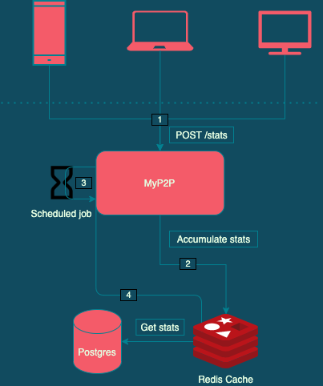

# MyP2P - Let's start streaming !
## Introduction

I used [Spring Initializr](https://start.spring.io/) to start my project.
It is a Java 11 project, using docker to spawn a PostgreSQL and Redis database instances.

Since this is a project that needs both instances to run, I made a dockerfile to 'dockerize' this project to launch the 3 components altogether.

Using gradle, you can build the project with the following command :
> $ ./gradlew build 
 
And then we can launch all three components, at the root of this project :
> $ cp build/libs/myp2p-1.0.0.jar .
> 
> $ docker-compose up --build

After start up, see the [OpenApi documentations](http://localhost:8080/swagger-ui.html) for more information about the endpoint.

## Project design

The solution revolves around using a cache, here Redis, to accumulates data, in order to save it once when the time window is up. 

I followed this logic : 
- [1] Data are and received through the '/stats' endpoints 
- [2] The application is accumulating all stats to the Redis cache in order to be later summed when the time window is up for a specific video session.
- [3] Each time a new video session is received on our side, we start a new timer. When the time is up for this video, we sum all received data in this time window looking at the Redis cache.
- [4] After getting the data from the Redis cache, we save the sum of cdn & p2p, we delete previous recording of statistics.
  We'll then start a new time window when we receive a new update of this video session and start over.

## Development details

### Step 1
From what I understood of the project, its main goal is to retrieve the sum of data consumed for each pair of customer & content. Therefore, having a way to identify a pair of customer & content, with the associated token (for the started session part) was the most important part.

I knew that a Redis cache would help me do that, and it also allows us to split the project into several parts. This separation allows us to scale on different parts of the project, whether we want to add more instances of the application, or add more instances of redis with sharding for example.

The main reason I went with Redis is that it handles well hashes. Redis hashes are handy when we want to represent objects, and it is exactly what we needed.
Overall how I wanted to represent the information is as follows :
> [key : "customer1:content1", value : "'token1' = {cdn = 123, p2p = 456}, 'token2' = {cdn = 11, p2p = 333}"]
>
> [key : "customer1:content2", value : "'token3' = {cdn = 1, p2p = 1}"]
>
> [key : "customer2:content10", value : "'token4' = {cdn = 9, p2p = 123}"]
>
> ...

Each time '/stats' endpoint is called, we insert the values into the cache.
If we want to update the value of 'token1', we retrieve it using the combination of key + token, increment and save it again.
If we want to get the number of started sessions, we sum the number of tokens present for a given key.

At the end a time windows session, we sum all token statistics of a given key into the Postgres database, and remove the key and its token registered from the cache.
A new session will be opened when received at the '/stats' endpoint.

### Step 2
Diving into the implementation the Redis and Postgres part is pretty straightforward.
The tricky part is to keep track of each active session to be later on collected when the time windows is up.

I went with the choice to keep track of active sessions in a hashmap where the key is the datetime when we can collect the data from Redis and the value is the cache key used to retrieve data on Redis.
An additional set is used to know if a pair of "customer:content" (cache key) is already active, to not insert anymore in the hashmap if received by the '/stats' endpoint.

This would be the first element I rework in a version 2 because in a case of application failure, we loose track of the data to retrieve.

### Next steps
- Do some stress testing and adjust the needs of resources.
- Make the process of statistics asynchronous. For example, by adding a messaging queue to consume at a precise datetime the list of pair of "consumer:content" to retrieve from Redis. Storing it into a hashmap is a shortcut.

### Misc
- Using TestContainers for the tests is not optimal since it is required to have docker on the local machine that runs the tests. But it simplifies a bit the configuration since we don't need embedded databases for both Redis and Postgres ; 
- I try not to comment my code that much, but instead having meaningful method names ;
- I used lombok for convenience, JUnit 5 for testing ;

Thank you if you went that far on the review, I will gladly take any comment on my code to improve myself.